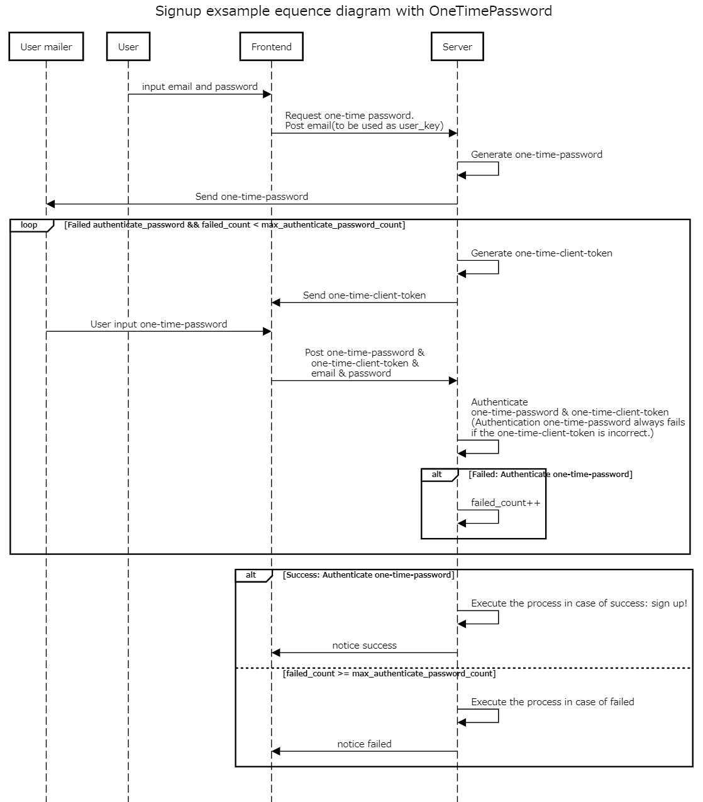

# OneTimePassword

This Gem can be used to create 2FA (Two-Factor Authentication) function, email address verification function for member registration and etc in Ruby on Rails.

## Installation

Add this line to your application's Gemfile:

```ruby
gem "one_time_password"
```

And then execute:

```bash
$ bundle
```

Or install it yourself as:

```bash
$ gem install one_time_password
```

## Usage

### Run command for an installation.

```bash
bundle exec rails g one_time_password:install
```

The following events will take place when using the install generator:

- An initializer file will be created at `config/initializers/one_time_password.rb`
- A migration file will be created at `db/migrate/xxxxxxxxxxxxxx_create_one_time_authentication.rb`
- A model file will be created at `app/models/one_time_authentication.rb`

And run migration.

```bash
bundle exec rails db:migrate
```

### Rewrite `FUNCTION_NAMES` and `CONTEXTS` in initializer settings.

Configuration in `config/initializers/one_time_password.rb`.

`FUNCTION_NAMES`: Using function_name in OneTimeAuthentication Model enum.

Hash, one of `CONTEXTS`:
| | |
| --- | --- |
| function_name (Symbol) | Name each function. |
| version (Integer) | Version each function_name. |
| expires_in (ActiveSupport::Duration) | Password validity time. |
| max_authenticate_password_count (Integer) | Number of times user can enter password each generated password. |
| password_length (Integer) | Password length. At 6, for example, the password would be 123456. |
| password_failed_limit (Integer)<br>password_failed_period (ActiveSupport::Duration) | If you try to authenticate with the wrong password a password_failed_limit times within the time set by password_failed_period, you will not be able to generate a new password. |
| | |

### See example and its sequence diagram

[here](#example-and-its-sequence-diagram)

### `OneTimePassword::OneTimeAuthentication`'s methods.

For more information, see the [implementation of OneTimePassword :: OneTimeAuthenticationModel](https://github.com/yosipy/one_time_password/blob/main/lib/one_time_password/one_time_authentication_model.rb).

## Example and its sequence diagram

See [sign up exsample](https://github.com/yosipy/one_time_password/blob/main/spec/dummy/app/controllers/test_users_controller.rb).

Sequence diagram.



<!-- ## Contributing
Contribution directions go here. -->

## License

The gem is available as open source under the terms of the [MIT License](https://opensource.org/licenses/MIT).
